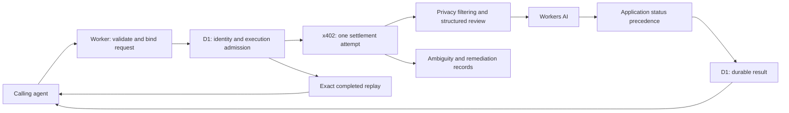

# SecondLook — independent review before an AI agent acts

[](https://github.com/EdgecaseSystems/secondlook-public/actions/workflows/ci.yml)

**Live service:** [Website](https://secondlook-site.edgecasesystems.workers.dev/) · [API](https://secondlook.edgecasesystems.workers.dev/) · [OpenAPI](https://secondlook.edgecasesystems.workers.dev/openapi.json) · [Paid review endpoint](https://secondlook.edgecasesystems.workers.dev/v1/paid/second-look)

**Portfolio evidence:** 300 automated tests across 18 files at publication · TypeScript · Cloudflare Workers/D1/Workers AI · x402 payments · passing CI

An AI agent can produce a convincing plan while overlooking missing authority, contradictory constraints, or an important unknown. SecondLook gives the caller a separate, structured review before it commits to an action.

**The production SecondLook service is live and designed for largely autonomous machine-to-machine operation.** Once deployed and configured, ordinary review and payment requests are processed end-to-end without a human operator. Human intervention is reserved for exceptional reconciliation/remediation and operational maintenance.

**This repository is a sanitized portfolio snapshot of the independently developed service.** It preserves the implementation and tests while replacing production identifiers and omitting credentials, private operational records, and deployment access. The public snapshot is not connected to production and is not an open-source release. [Rights and limited portfolio-evaluation permission](NOTICE.md).

## What the service does

The caller submits its goal, proposed action, authority, known facts, constraints, and reasoning. SecondLook returns one of four observational statuses with reasons, risks, and missing information:

- `no_material_concern_found`
- `material_concern_found`
- `insufficient_information`
- `human_review_required`

The caller owns authority and execution. **SecondLook never grants or supplies missing authority.** A result with no material concern is not permission or a guarantee of correctness.

For example, an agent may propose sending a customer refund while its authority is unresolved. The review contract is designed to preserve that missing-authority issue instead of treating a plausible business reason as authorization. Examples describe intended behavior; they are not measured model-performance claims.

## My role and the development approach

I led problem definition, product design, architecture decisions, behavioral requirements, risk analysis, testing strategy, debugging direction, and acceptance of the result. AI coding agents implemented much of the code. My contribution was directing and evaluating that work: challenging assumptions, comparing behavior against requirements, isolating failures, and requiring corrections and regression coverage.

SecondLook and its companion [Wait](https://github.com/EdgecaseSystems/wait-public) were developed during the late-August to early-September 2026 EdgecaseSystems build period. The public repositories start with sanitized snapshots, so their commit dates do not represent the original development chronology. This repository does not claim that I manually authored every line or that automated tests establish production readiness.

## Engineering problems solved

| Problem | Design decision | Evidence to inspect |
| --- | --- | --- |
| An AI review could mistake plausibility for authority | Structured authority and constraints plus deterministic application-level status precedence | [Judgment engine](src/judgment.ts), [constraint handling](src/constraints.ts), [judgment tests](test/judgment.test.ts) |
| A retry could charge twice or run inference again | Durable request identity, payload binding, payment state, execution admission, and completed-result replay | [Idempotency](src/idempotency.ts), [payment lifecycle](src/payments.ts), [paid endpoint tests](test/paid-endpoint.test.ts) |
| A timeout does not prove payment or inference failed | Explicit ambiguous states and operator reconciliation records; no blind settlement or inference retries | [Remediation](src/remediation.ts), [reconciliation validation](scripts/reconciliation-evidence.mjs), [remediation tests](test/remediation.test.mjs) |
| Submitted context can contain sensitive text | Limited pattern redaction before model processing and bounded error handling | [Privacy handling](src/privacy.ts), [privacy tests](test/privacy.test.ts) |
| Model accuracy can look better when failed requests are excluded carelessly | Versioned scenarios, repeated scoring, dangerous-false-clear checks, and explicit incomplete-run reporting | [Evaluation fixtures](evals), [evaluation harness](scripts/run-evals.mjs), [harness tests](test/eval-harness.test.mjs) |
| An unfamiliar client needs a precise integration contract | Machine-readable discovery, OpenAPI, structured errors, and buyer guidance | [OpenAPI](openapi.yaml), [public API](src/public-api.ts), [cold-client tests](test/cold-agent-integration.test.ts) |

## Architecture



TypeScript implements the Worker, Cloudflare D1 stores durable state, Workers AI supplies the model response, and x402 supports machine-to-machine payment. The snapshot also retains a separately configured provider adapter; no provider credentials are included. [Architecture and trust boundaries](docs/ARCHITECTURE.md).

## Inspect and validate

Start with the table above, then inspect the migrations and tests alongside the implementation. The maintained validation path uses mocked external services and local databases; it requires no Cloudflare sign-in, wallet, or model API key.

Prospective employers and portfolio reviewers may clone and execute the sample locally under the limited evaluation permission in [NOTICE.md](NOTICE.md). Use Node.js 22.13 or newer (the tests use `node:sqlite`):

```text
npm ci --no-audit --no-fund
npm run verify:offline
```

The gate checks types, runs the retained test suite, and builds a Wrangler dry-run bundle. A dry run does not deploy. The GitHub workflow performs the same offline gate and contains no deployment or production monitoring job. Evaluation utilities are retained for inspection and mocked harness tests; do not run them against a live model as part of portfolio validation.

## Publication boundaries and limitations

Production credentials/configuration are intentionally omitted. Database identifiers are placeholders, service/support addresses inside the snapshot use reserved example domains, preview and workers.dev publication are disabled in the snapshot configuration, and deployment/remote-migration commands have been removed from package scripts. Production Git history, logs, customer records, credential helpers, and internal operational documents were not exported.

The live links at the top of this README point to the separately deployed production service and landing page; they do not make this sanitized repository a production configuration. The included service terms, privacy text, and pricing constants illustrate the application's contract. Pattern redaction is not comprehensive anonymization. The seven-day replay window is not a deletion guarantee for substantive decision records; those records have a separate lifecycle and no automatic fixed deletion deadline in this implementation. Mocked tests verify software behavior, not model accuracy, legal compliance, or live-service availability.

See [publication review](docs/PUBLICATION_REVIEW.md) for the sanitization scope and validation evidence.

## Rights

Copyright (c) 2026 EdgecaseSystems. All rights reserved to the extent applicable. No open-source or general reuse license is granted. A narrow permission for prospective employers and other portfolio reviewers to clone and execute the snapshot locally for evaluation is described in [NOTICE.md](NOTICE.md). GitHub's Terms of Service and applicable law still apply, including GitHub's viewing and forking functionality. Third-party components retain their own licenses.
